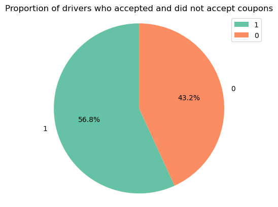
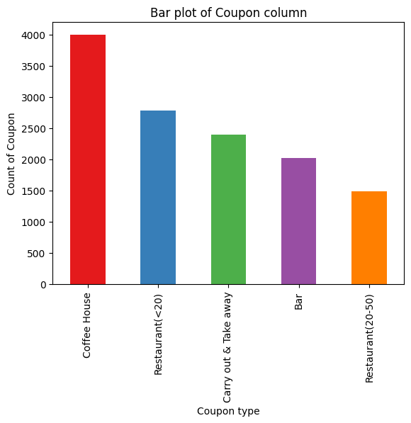

5.1: Will the Customer Accept the Coupon?

1. Read in the `coupons.csv` file.
   
2. Investigate the dataset for missing or problematic data.
Study of dataset: dimentionality, type, zero-count

3. Investigate the dataset for missing or problematic data.
Study of dataset: dimentionality, type, zero-count

    3.1. 99.1% data from the "car" column is missing
        I decided not to use data from this column:

    3.2. Study series with a small amount of missing data (less than 1.71%) and save list of columns(column_w_missing) with missings.
                Column name: Bar found 107 NaN values - Uique values: ['never' 'less1' '1~3' 'gt8' nan '4~8']
                Column name: CoffeeHouse found 217 NaN values - Unique values: ['never' 'less1' '4~8' '1~3' 'gt8' nan]
                Column name: CarryAway found 151 NaN values - Unique values: [nan '4~8' '1~3' 'gt8' 'less1' 'never']
                Column name: RestaurantLessThan20 found 130 NaN values - Unique values: ['4~8' '1~3' 'less1' 'gt8' nan 'never']
                Column name: Restaurant20To50 found 189 NaN values - Unique values: ['1~3' 'less1' 'never' 'gt8' '4~8' nan]

    3.3. I decided to impute the missing values using mode (because the number of missing values is not significant - less than 1.7%)
                Filled missing values in 'Bar' with mode: never
                Filled missing values in 'CoffeeHouse' with mode: less1
                Filled missing values in 'CarryAway' with mode: 1~3
                Filled missing values in 'RestaurantLessThan20' with mode: 1~3
                Filled missing values in 'Restaurant20To50' with mode: less1

4. What proportion of the total observations chose to accept the coupon?
% drivers who accepted coupon out of the entire dataset
                
5. Use a bar plot to visualize the `coupon` column.
                
